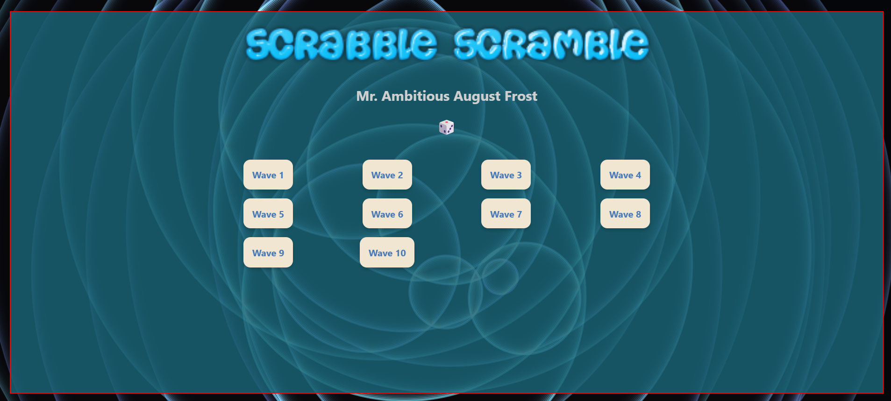

## SCRABBLE SCRAMBLE

https://lostwords.itch.io/scrabblescramble

https://github.com/pasciaks/game-off-2025

## Game Off 2025

Game Off is an annual game jam challenging individuals and teams to build a game during the month of November.

# Asset license, etc

The assets included in this repo are the property of their respective owners and cannot be sold or re-published for other use. The are provided here free of charge for this game implementation. Some assets that may or may not be used are from the following itch and other locations.

-https://screamingbrainstudios.itch.io/2d-word-game-pack

-https://bdragon1727.itch.io/72-cute-pixel-character

# Credits

Credits, acknowledgements and thank you!

### Thanks:

WrongWay for the inspiration to make a Scrabble game in the tradition of the old game with something new.

### Resources:

https://screamingbrainstudios.itch.io/2d-word-game-pack

https://bdragon1727.itch.io/72-cute-pixel-character

https://www.freescrabbledictionary.com/

https://freesvg.org/

https://freepd.com/

https://cooltext.com/

### Code Help:

Stack Overflow , Google Search ? NOPE! => Chat GPT!

---

# Instructions about waves

## During the game, if waves mode is enabled, the wave icons have a white background instead of a red one.

## When enabled, after you place a word, a random wave mode may or may not be invoked.

## Based on the wave mode invoked, different rules for placing letter tiles are applied.

---

# 📡 Micro wave

-When this wave is invoked, you may only submit 1 or 2 letters to create a word.

# 📻 RadiO wave

-When this wave is invoked, you must submit a consonant as your first letter and a vowel as your last.

# 🎙️ SounD wave

-When this wave is invoked, you must submit a consonant as your first letter and a vowel as your last.

# 💡 ElectromagnetiC wave

-When this wave is invoked, you must submit a vowel as your first letter and a consonant as your last.

# 🔋 EngerY wave

-When this wave is invoked, you must submit a vowel as your first letter and a vowel as your last.

---

# Game Instructions / Documentation

[Scrabble Scramble PDF](GitHubGameJamItch/ss-docs/Scrabble%20Scramble.pdf)

---

## Here's some more info if you are interested in waves!

1. Microwave

Part of the electromagnetic spectrum.

Wavelength: 1 mm – 1 m.

Uses: Cooking (microwave ovens), radar, satellite communication, and wireless networks.

Propagation: Can pass through clouds, smoke, and light rain, but absorbed by water.

2. Radio Wave

Longest wavelengths in the electromagnetic spectrum (meters to kilometers).

Frequency: 3 kHz – 300 GHz.

Uses: Broadcasting (AM/FM), Wi-Fi, cell phones, and two-way radios.

Propagation: Can travel long distances, can reflect off the ionosphere.

3. Sound Wave

A mechanical wave, specifically a longitudinal wave.

Travels through air, water, and solids.

Frequency range: 20 Hz – 20 kHz (human hearing).

Speed: ~343 m/s in air at room temperature.

Used in: Music, speech, sonar, medical imaging (ultrasound).

4. Electromagnetic Wave

Includes radio, microwave, infrared, visible light, UV, X-rays, gamma rays.

Travels at the speed of light (~3×10⁸ m/s) in a vacuum.

Consists of oscillating electric and magnetic fields perpendicular to each other and the direction of propagation.

Can carry energy, information, and radiation.

5. Energy Wave (or “waves of energy”)

Any wave that transfers energy through a medium or space.

Could be mechanical energy (like a water wave) or electromagnetic energy (like sunlight).

Principle: Waves carry energy without transporting matter permanently, though particles in the medium may oscillate.

---

[x] Known 'features'

Bonus words that are found when you aren't playing are marked off your bonus word list - Ideally, everyone in a game starts at the same time and this would allow for fair-play, but life isn't fair, so I'm not (for now) going to implement syncing that info when others join a game room after others have been creating words in it already.

[ ] Probably more to find, investigate and report.

[ ] Floating words... you can float words, but only during the wave cycle. This occurs when the client time (minutes) are in the following ranges.

      0-1
      5-10
      25-35
      45-50
      50-54

